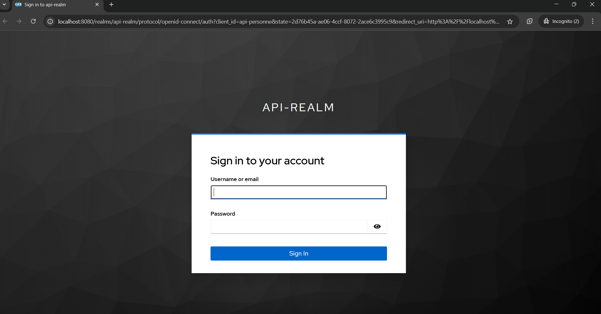

# 🔐 Keycloak Integration Demo

This project demonstrates how to integrate [Keycloak](https://www.keycloak.org/) with an Express.js application, including session handling and route protection.

---

## 📸 Screenshots

### 🛠️ Admin Panel

---

### 🔐 Login Page

---

### 🚪 Logout Page

